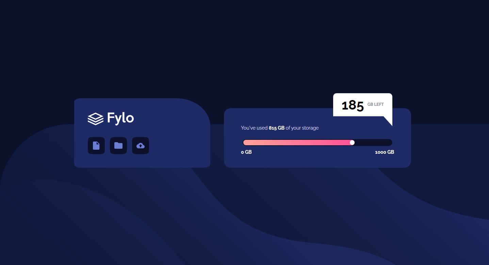
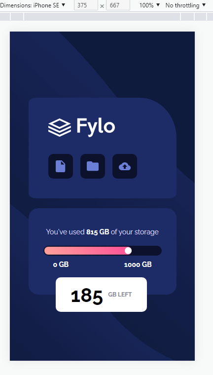

# Frontend Mentor - Fylo data storage component solution

This is my solution to the [Fylo data storage component challenge on Frontend Mentor](https://www.frontendmentor.io/challenges/fylo-data-storage-component-1dZPRbV5n). 

## Table of contents

- [Overview](#overview)
  - [The challenge](#the-challenge)
  - [Screenshot](#screenshot)
- [My process](#my-process)
  - [Built with](#built-with)
  - [Useful resources](#useful-resources)
- [Author](#author)

## Overview

### The challenge

Users should be able to:

- View the optimal layout for the site depending on their device's screen size

### Screenshot

## My process

### Built with

- Semantic HTML5 markup
- CSS custom properties
- Flexbox

### Useful resources

- [Clippy - CSS Clip Path Maker](https://bennettfeely.com/clippy/) - made that little pop-up with 185 GB left with this. Really makes creating all sorts of shapes easily.

## Author

- Mladen Antic - [@MladenAntic](https://www.frontendmentor.io/profile/MladenAntic)
